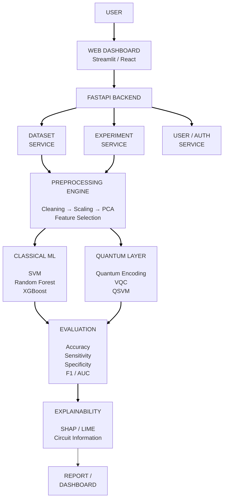
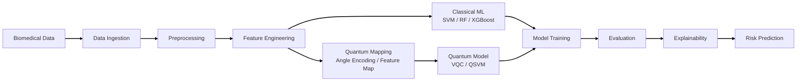
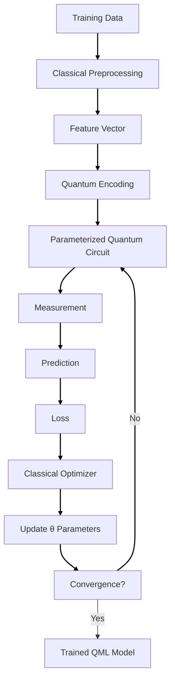
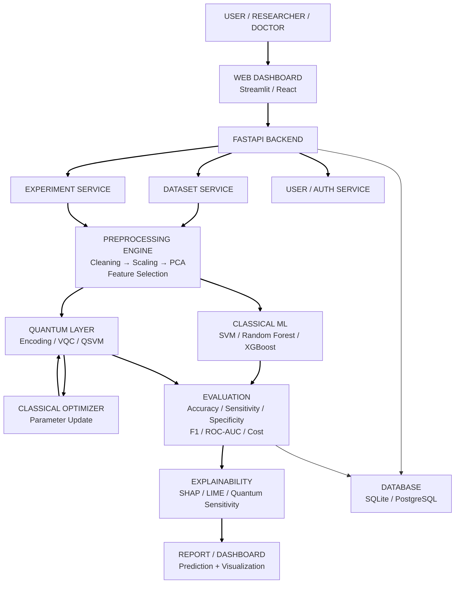

# Dr. Radar
## Hybrid Quantum-Classical Machine Learning Platform for Early Disease Detection

> **SIH 2026 Project**

Dr. Radar is an end-to-end research and decision-support platform that combines classical machine learning, quantum machine learning (QML), explainable AI (XAI), and biomedical data processing for early disease-risk classification.

The platform is designed around a practical principle:

> **Do not assume quantum advantage. Measure it.**

Dr. Radar preprocesses biomedical data, performs feature selection and dimensionality reduction, trains strong classical baselines and quantum/hybrid models, evaluates them under ideal and noisy conditions, and presents explainable predictions through a web dashboard.

**Important:** Dr. Radar is a research prototype and is **not a medical diagnostic device**. Its predictions must not be used as a substitute for clinical assessment.

---

## Table of Contents

1. [Problem Statement](#problem-statement)
2. [Project Objectives](#project-objectives)
3. [Proposed Solution](#proposed-solution)
4. [Key Innovation](#key-innovation)
5. [System Architecture](#system-architecture)
6. [End-to-End Workflow](#end-to-end-workflow)
7. [Hybrid Quantum-Classical Method](#hybrid-quantum-classical-method)
8. [Machine Learning Models](#machine-learning-models)
9. [Quantum Machine Learning](#quantum-machine-learning)
10. [Data Pipeline](#data-pipeline)
11. [Feature Engineering](#feature-engineering)
12. [Explainable AI](#explainable-ai)
13. [Evaluation and Benchmarking](#evaluation-and-benchmarking)
14. [Noise and Hardware Evaluation](#noise-and-hardware-evaluation)
15. [Technology Stack](#technology-stack)
16. [Project Architecture](#project-architecture)
17. [Repository Structure](#repository-structure)
18. [Installation](#installation)
19. [Configuration](#configuration)
20. [Running the Project](#running-the-project)
21. [Example Workflow](#example-workflow)
22. [API Design](#api-design)
23. [Database Design](#database-design)
24. [Security and Privacy](#security-and-privacy)
25. [Reproducibility](#reproducibility)
26. [Testing](#testing)
27. [Deployment](#deployment)
28. [Feasibility and Risks](#feasibility-and-risks)
29. [Limitations](#limitations)
30. [Future Scope](#future-scope)
31. [Expected Deliverables](#expected-deliverables)
32. [Research Positioning](#research-positioning)
33. [References](#references)

---

# Problem Statement

Early disease detection can improve the opportunity for timely intervention and can potentially reduce healthcare burden. Biomedical datasets can contain many variables, nonlinear relationships, noise, missing values, class imbalance, and heterogeneous data types.

Classical ML provides mature tools for these tasks, but the project investigates whether quantum-enhanced representations can provide useful additional value for selected biomedical problems.

Current quantum hardware is constrained by limited qubit counts, noise, circuit depth, connectivity, and execution cost. Therefore, Dr. Radar uses a **hybrid quantum-classical architecture** rather than attempting to move the complete ML pipeline onto a quantum processor.

### Core problem

Given biomedical data:

\[
X = \{x_1,x_2,\ldots,x_n\}
\]

and disease labels:

\[
y \in \{0,1\}
\]

build a reproducible pipeline that can:

1. ingest biomedical data;
2. clean and normalize it;
3. select informative features;
4. reduce the feature space to a quantum-compatible dimension;
5. train classical and quantum/hybrid models;
6. compare their performance fairly;
7. test robustness to quantum noise;
8. explain predictions;
9. present results through an interactive dashboard.

---

# Project Objectives

- Design a practical hybrid quantum-classical architecture.
- Support biomedical tabular data initially, with extensibility to imaging, EHR and genomics.
- Implement classical baselines such as SVM, Random Forest and XGBoost.
- Implement quantum models such as VQC and QSVM/QSVC.
- Reduce high-dimensional input to a quantum-compatible feature vector.
- Compare accuracy, sensitivity, specificity, F1, ROC-AUC and computational cost.
- Analyze model robustness under simulated quantum noise.
- Provide interpretable feature-level explanations.
- Support quantum simulators and optional real quantum hardware.
- Maintain reproducibility through fixed data splits, seeds, configuration files and experiment logs.
- Provide a user-friendly web dashboard for researchers and healthcare-AI teams.

---

# Proposed Solution

## High-level concept

```text
Biomedical Data
       |
       v
Data Ingestion
       |
       v
Preprocessing
       |
       v
Feature Engineering
       |
       +-----------------------+
       |                       |
       v                       v
 Classical ML              Quantum ML
 SVM/RF/XGBoost            Encoding -> VQC/QSVM
       |                       |
       +-----------+-----------+
                   |
                   v
              Benchmarking
                   |
                   v
             Explainability
                   |
                   v
        Early Disease-Risk Output
                   |
                   v
             Web Dashboard
```

The same preprocessed dataset is used for classical and quantum experiments so that the comparison is as fair as possible.

---

# Key Innovation

## 1. Quantum Suitability Analyzer

Instead of forcing QML onto every dataset, Dr. Radar can estimate whether a dataset is appropriate for a quantum experiment based on:

- sample size;
- feature dimensionality;
- feature correlations;
- nonlinear separability;
- class imbalance;
- reduced feature dimension;
- estimated qubit requirements;
- circuit depth;
- noise sensitivity.

The system can recommend a classical or hybrid path.

## 2. Adaptive Feature-to-Qubit Mapping

If a dataset contains 30, 100 or 1,000 features, it cannot simply be mapped one-to-one onto a small NISQ circuit.

Dr. Radar performs:

```text
Original features
       |
       v
Feature importance
       |
       v
Correlation filtering
       |
       v
PCA / dimensionality reduction
       |
       v
4 / 6 / 8 / 10-dimensional representation
       |
       v
Quantum encoding
```

## 3. Quantum-vs-Classical Benchmarking

The platform does not claim quantum advantage beforehand.

It measures:

- classical performance;
- quantum performance;
- hybrid performance;
- ideal simulator performance;
- noisy simulator performance;
- optional hardware performance.

## 4. Noise-Aware QML Evaluation

Quantum models can be evaluated under realistic noise models.

A useful robustness metric is:

\[
\Delta M = M_{\mathrm{ideal}} - M_{\mathrm{noisy}}
\]

where \(M\) can be accuracy, F1, ROC-AUC or sensitivity.

## 5. Explainable Quantum-Assisted Prediction

The platform combines:

- SHAP;
- LIME where appropriate;
- feature perturbation;
- quantum circuit visualization;
- quantum parameter/measurement information.

---

# System Architecture



---

# End-to-End Workflow



---

# Hybrid Quantum-Classical Method

The central training loop is:



## Mathematical view

Let:

\[
x = [x_1,x_2,\ldots,x_d]
\]

be a normalized feature vector.

A quantum feature map transforms the input into a quantum state:

\[
|\phi(x)\rangle = U(x)|0\rangle^{\otimes n}
\]

A parameterized circuit is then applied:

\[
|\psi(x,\theta)\rangle = U(\theta)|\phi(x)\rangle
\]

Measurements generate expectation values:

\[
z = \langle\psi(x,\theta)|O|\psi(x,\theta)\rangle
\]

The classical optimizer minimizes a loss:

\[
\theta^* = \arg\min_{\theta} L(y,\hat{y})
\]

The process is repeated until the stopping criterion is reached.

---

# Machine Learning Models

## Classical baselines

### Logistic Regression

Useful as a simple interpretable baseline.

### Support Vector Machine

Use an RBF kernel as a strong classical comparison:

\[
K(x_i,x_j)=
\exp(-\gamma\|x_i-x_j\|^2)
\]

### Random Forest

Useful for nonlinear relationships and feature importance.

### XGBoost

A strong tree-based gradient boosting baseline.

---

# Quantum Machine Learning

## Variational Quantum Classifier

VQC uses:

1. classical feature vector;
2. quantum encoding;
3. parameterized gates;
4. entanglement;
5. measurement;
6. classical loss;
7. classical optimizer.

Example conceptual circuit:

```text
q0 ──Ry(x1)──Rz(θ1)──●────────────
                      │
q1 ──Ry(x2)──Rz(θ2)──X──●─────────
                         │
q2 ──Ry(x3)──Rz(θ3)─────X──●──────
                            │
q3 ──Ry(x4)──Rz(θ4)────────X──────
```

## QSVM / QSVC

A quantum kernel can replace a classical kernel:

\[
K_Q(x_i,x_j)
=
|\langle\phi(x_i)|\phi(x_j)\rangle|^2
\]

The resulting kernel matrix can be passed to a support vector classifier.

---

# Data Pipeline

## Supported conceptual data types

### Tabular

Examples:

- clinical measurements;
- laboratory values;
- demographic variables;
- disease biomarkers.

### Genomics

Examples:

- gene expression;
- selected genomic biomarkers.

### Imaging

Future architecture:

```text
Image
  |
  v
CNN / Vision Transformer
  |
  v
Deep Feature Vector
  |
  v
PCA / Feature Selection
  |
  v
Quantum Classifier
```

### EHR

Future architecture can consume structured patient records or interoperable healthcare data after appropriate privacy and governance controls.

---

# Recommended Initial Dataset

For the first SIH prototype, use a small public tabular dataset such as the **Wisconsin Diagnostic Breast Cancer (WDBC)** dataset.

Why:

- binary classification;
- manageable dimensionality;
- public benchmark;
- suitable for classical ML;
- suitable for reduced-dimensional QML experiments;
- easy to demonstrate in a hackathon environment.

The platform should remain disease-agnostic so that additional datasets can be added later.

---

# Preprocessing

## Missing values

Possible methods:

- median imputation;
- KNN imputation;
- domain-specific imputation.

## Scaling

Standardization:

\[
z = \frac{x-\mu}{\sigma}
\]

or min-max normalization:

\[
x' =
\frac{x-x_{\min}}
{x_{\max}-x_{\min}}
\]

Scaling is important before many ML algorithms and before angle-based quantum encoding.

## Outliers

Potential approaches:

- IQR filtering;
- robust scaling;
- winsorization;
- domain-aware thresholds.

Do not automatically remove medically meaningful observations without domain justification.

---

# Feature Engineering

## Feature selection

Candidate methods:

- mutual information;
- correlation filtering;
- recursive feature elimination;
- L1 regularization;
- tree-based feature importance;
- SHAP-based ranking.

## PCA

Principal Component Analysis reduces the input dimension.

Given centered data matrix \(X\):

\[
X = U\Sigma V^T
\]

Select the first \(k\) components:

\[
Z = XW_k
\]

where \(k\) is chosen according to the experiment and quantum resource budget.

---

# Quantum Encoding

## Angle encoding

For a normalized feature \(x_i\):

\[
x_i \rightarrow R_y(x_i)
\]

or another rotation convention.

Example:

```text
x1 → Ry(x1)
x2 → Ry(x2)
x3 → Ry(x3)
x4 → Ry(x4)
```

## Feature maps

Possible experiments:

- simple angle encoding;
- Pauli-based feature maps;
- ZZ feature maps;
- shallow entangling maps.

The project should measure whether a more complex feature map actually improves results.

---

# Explainable AI

## SHAP

SHAP assigns feature contributions based on Shapley-value concepts.

For a prediction:

```text
Prediction: High Risk

Feature A    +0.31
Feature B    +0.22
Feature C    +0.14
Feature D    -0.09
```

## LIME

LIME can provide local explanations by approximating a complex model around a particular sample.

## Quantum feature sensitivity

A practical prototype method:

```text
Original feature vector
        |
        v
Run quantum model
        |
        v
Perturb one feature
        |
        v
Run quantum model again
        |
        v
Measure prediction change
```

For feature \(i\):

\[
S_i =
|\hat{y}(x)-\hat{y}(x+\delta e_i)|
\]

where \(e_i\) changes only feature \(i\).

This can be presented as **quantum feature sensitivity**, while clearly documenting that it is a perturbation-based interpretability measure rather than a universally standardized quantum explanation method.

---

# Evaluation and Benchmarking

Accuracy alone is insufficient for disease-risk classification.

## Confusion matrix

```text
                 Predicted
                Negative Positive

Actual Negative    TN       FP
Actual Positive    FN       TP
```

## Accuracy

\[
Accuracy =
\frac{TP+TN}
{TP+TN+FP+FN}
\]

## Sensitivity / Recall

\[
Sensitivity =
\frac{TP}
{TP+FN}
\]

## Specificity

\[
Specificity =
\frac{TN}
{TN+FP}
\]

## Precision

\[
Precision =
\frac{TP}
{TP+FP}
\]

## F1-score

\[
F1 =
2\frac{Precision \cdot Recall}
{Precision+Recall}
\]

## ROC-AUC

Measure discrimination across classification thresholds.

## PR-AUC

Useful when positive cases are relatively uncommon.

## Calibration

Where probability outputs are used, evaluate whether predicted probabilities correspond reasonably to observed frequencies.

## Computational metrics

Also record:

- training time;
- inference time;
- memory use;
- number of qubits;
- circuit depth;
- number of circuit evaluations;
- simulator runtime;
- hardware queue/execution time when available.

---

# Benchmark Matrix

A recommended experiment matrix is:

| Condition | Classical SVM | QSVM | VQC | Hybrid |
|---|---:|---:|---:|---:|
| Ideal simulator | ✓ | ✓ | ✓ | ✓ |
| Noisy simulator | ✓ | ✓ | ✓ | ✓ |
| Real QPU | Optional | Optional | Optional | Optional |
| 4 features | ✓ | ✓ | ✓ | ✓ |
| 8 features | ✓ | ✓ | ✓ | ✓ |
| 12 features | ✓ | ✓ | ✓ | ✓ |

Do not publish fabricated values. Populate the table only from reproducible experiments.

---

# Statistical Evaluation

A single train/test split can be unstable on small datasets.

Recommended:

- stratified k-fold cross-validation;
- repeated experiments with multiple random seeds;
- confidence intervals where practical;
- paired comparison of folds when appropriate;
- external validation if an independent dataset exists.

Report mean and standard deviation:

\[
\bar{x} \pm s
\]

Do not tune hyperparameters using the final test set.

---

# Noise and Hardware Evaluation

## Ideal simulation

Run circuits without a noise model.

## Noisy simulation

Introduce realistic noise models where supported.

Compare:

\[
M_{ideal}
\quad \text{vs.} \quad
M_{noisy}
\]

Calculate:

\[
Noise\ Degradation =
M_{ideal}-M_{noisy}
\]

## Hardware

When access is available:

```text
Local development
      |
      v
Ideal simulator
      |
      v
Noisy simulator
      |
      v
Cloud QPU
```

The QPU stage should be considered a validation experiment rather than a mandatory dependency for the core application.

---

# Technology Stack

## Frontend

- Streamlit
- Plotly

Optional production frontend:

- React
- JavaScript/TypeScript
- HTML/CSS

## Backend

- Python
- FastAPI
- REST APIs
- Pydantic

## Machine Learning

- scikit-learn
- XGBoost
- PyTorch or TensorFlow

## Quantum Computing

- Qiskit
- Qiskit Aer
- IBM Quantum
- PennyLane (optional)

## Data Processing

- Pandas
- NumPy
- SciPy

## Explainability

- SHAP
- LIME
- Plotly/Matplotlib for visualizations

## Database

Development:

- SQLite

Production:

- PostgreSQL

## DevOps

- Git
- GitHub
- Docker

## Cloud

Potential targets:

- AWS
- Google Cloud Platform
- Microsoft Azure

---

# Project Architecture



---

# Repository Structure

Recommended structure:

```text
Dr. Radar/
│
├── README.md
├── LICENSE
├── .gitignore
├── .env.example
├── requirements.txt
├── pyproject.toml
├── Dockerfile
├── docker-compose.yml
│
├── app/
│   ├── main.py
│   │
│   ├── api/
│   │   ├── routes/
│   │   │   ├── datasets.py
│   │   │   ├── experiments.py
│   │   │   ├── predictions.py
│   │   │   └── health.py
│   │   └── schemas.py
│   │
│   ├── core/
│   │   ├── config.py
│   │   ├── logging.py
│   │   └── security.py
│   │
│   ├── data/
│   │   ├── ingestion.py
│   │   ├── validation.py
│   │   ├── preprocessing.py
│   │   └── feature_engineering.py
│   │
│   ├── models/
│   │   ├── classical/
│   │   │   ├── svm.py
│   │   │   ├── random_forest.py
│   │   │   └── xgboost_model.py
│   │   │
│   │   └── quantum/
│   │       ├── encoding.py
│   │       ├── feature_maps.py
│   │       ├── vqc.py
│   │       ├── qsvm.py
│   │       └── circuits.py
│   │
│   ├── training/
│   │   ├── trainer.py
│   │   ├── optimizer.py
│   │   └── experiment.py
│   │
│   ├── evaluation/
│   │   ├── metrics.py
│   │   ├── benchmark.py
│   │   └── robustness.py
│   │
│   ├── explainability/
│   │   ├── shap_explainer.py
│   │   ├── lime_explainer.py
│   │   └── quantum_sensitivity.py
│   │
│   └── database/
│       ├── models.py
│       └── session.py
│
├── frontend/
│   ├── streamlit_app.py
│   ├── pages/
│   │   ├── 01_dataset.py
│   │   ├── 02_preprocessing.py
│   │   ├── 03_training.py
│   │   ├── 04_prediction.py
│   │   ├── 05_explainability.py
│   │   └── 06_benchmark.py
│   └── components/
│
├── notebooks/
│   ├── 01_dataset_analysis.ipynb
│   ├── 02_classical_baselines.ipynb
│   ├── 03_vqc.ipynb
│   ├── 04_qsvm.ipynb
│   └── 05_noise_analysis.ipynb
│
├── data/
│   ├── raw/
│   ├── processed/
│   └── README.md
│
├── experiments/
│   ├── configs/
│   └── results/
│
├── tests/
│   ├── test_preprocessing.py
│   ├── test_models.py
│   ├── test_metrics.py
│   └── test_api.py
│
└── docs/
    ├── architecture.md
    ├── methodology.md
    └── api.md
```

---

# Installation

## 1. Clone repository

```bash
git clone https://github.com/<your-org>/Dr. Radar.git
cd Dr. Radar
```

## 2. Create virtual environment

Linux/macOS:

```bash
python -m venv .venv
source .venv/bin/activate
```

Windows:

```powershell
python -m venv .venv
.venv\Scripts\activate
```

## 3. Install dependencies

```bash
pip install --upgrade pip
pip install -r requirements.txt
```

Example dependency set:

```text
numpy
pandas
scipy
scikit-learn
xgboost
matplotlib
plotly
streamlit
fastapi
uvicorn
pydantic
sqlalchemy
shap
lime
qiskit
qiskit-aer
python-dotenv
joblib
```

Quantum package versions should be pinned after the team validates the chosen Qiskit APIs, because quantum software APIs evolve quickly.

---

# Configuration

Create:

```bash
cp .env.example .env
```

Example:

```env
APP_ENV=development
DATABASE_URL=sqlite:///./qdiag.db

RANDOM_SEED=42

QUANTUM_BACKEND=statevector
USE_HARDWARE=false

IBM_QUANTUM_TOKEN=
```

Never commit real credentials.

---

# Running the Project

## Start FastAPI

```bash
uvicorn app.main:app --reload
```

API:

```text
http://localhost:8000
```

Swagger documentation:

```text
http://localhost:8000/docs
```

## Start Streamlit

```bash
streamlit run frontend/streamlit_app.py
```

Dashboard:

```text
http://localhost:8501
```

---

# Example Workflow

## Step 1 — Upload dataset

```text
Dataset → CSV
Target column → diagnosis
```

## Step 2 — Validate

Check:

- number of rows;
- number of features;
- missing values;
- duplicated rows;
- target distribution;
- data types.

## Step 3 — Preprocess

```text
Imputation
    ↓
Outlier strategy
    ↓
Scaling
```

## Step 4 — Feature engineering

```text
Correlation analysis
       ↓
Feature selection
       ↓
PCA
       ↓
4–8 quantum-compatible features
```

## Step 5 — Train classical baselines

```text
SVM
Random Forest
XGBoost
```

## Step 6 — Train QML

```text
Feature vector
       ↓
Quantum encoding
       ↓
VQC / QSVM
       ↓
Classical optimization
```

## Step 7 — Evaluate

Generate:

- confusion matrix;
- ROC curve;
- PR curve;
- metric table;
- training/inference timing.

## Step 8 — Explain

Generate:

- SHAP summary;
- local explanation;
- feature sensitivity;
- circuit visualization.

## Step 9 — Compare

```text
Classical vs Quantum vs Hybrid
```

---

# API Design

## Health check

```http
GET /api/v1/health
```

Response:

```json
{
  "status": "ok",
  "service": "Dr. Radar"
}
```

## Upload dataset

```http
POST /api/v1/datasets
Content-Type: multipart/form-data
```

## Dataset information

```http
GET /api/v1/datasets/{dataset_id}
```

Example:

```json
{
  "dataset_id": "ds_001",
  "samples": 569,
  "features": 30,
  "target": "diagnosis"
}
```

## Start experiment

```http
POST /api/v1/experiments
```

Example request:

```json
{
  "dataset_id": "ds_001",
  "models": [
    "svm",
    "random_forest",
    "xgboost",
    "vqc",
    "qsvm"
  ],
  "n_components": 8,
  "test_size": 0.2,
  "random_seed": 42
}
```

## Experiment status

```http
GET /api/v1/experiments/{experiment_id}
```

## Prediction

```http
POST /api/v1/predictions
```

Example:

```json
{
  "model_id": "model_001",
  "features": [0.23, 0.51, -0.18, 0.77]
}
```

## Explanation

```http
GET /api/v1/predictions/{prediction_id}/explanation
```

---

# Database Design

Recommended tables:

## users

```text
id
email
password_hash
role
created_at
```

## datasets

```text
id
name
source
feature_count
sample_count
target_column
created_at
```

## experiments

```text
id
dataset_id
model_type
configuration
status
created_at
completed_at
```

## metrics

```text
id
experiment_id
accuracy
precision
sensitivity
specificity
f1
roc_auc
pr_auc
training_time
inference_time
```

## predictions

```text
id
experiment_id
prediction
probability
created_at
```

## explanations

```text
id
prediction_id
method
feature_contributions
metadata
```

---

# Security and Privacy

Healthcare data requires strong privacy controls.

## Prototype

Use:

- public datasets;
- anonymized data;
- synthetic patient records;
- no personally identifiable information.

## Production direction

Implement:

- TLS/HTTPS;
- authentication;
- role-based authorization;
- encryption at rest;
- encryption in transit;
- audit logs;
- secure secrets management;
- data retention policies;
- access control;
- dataset provenance.

Never place:

- patient names;
- phone numbers;
- addresses;
- hospital IDs;
- government IDs;
- credentials

inside Git repositories or public demo datasets.

Applicable healthcare/privacy regulations must be assessed for the deployment jurisdiction before real clinical data is processed.

---

# Reproducibility

Every experiment should record:

```text
Dataset version
Random seed
Train/test split
Cross-validation configuration
Preprocessing configuration
Selected features
PCA components
Quantum encoding
Feature map
Number of qubits
Circuit depth
Optimizer
Learning rate
Number of iterations
Noise model
Backend
Software versions
Metrics
```

Recommended seed:

```python
RANDOM_SEED = 42
```

For every experiment, save:

```text
experiments/results/
    experiment_001.json
    experiment_001_metrics.csv
    experiment_001_config.yaml
```

---

# Testing

## Unit tests

Test:

- preprocessing;
- feature selection;
- scaling;
- model training;
- metric calculations;
- quantum circuit construction;
- API validation.

## Integration tests

Test:

```text
Upload
  ↓
Preprocess
  ↓
Train
  ↓
Evaluate
  ↓
Explain
  ↓
Predict
```

## Model tests

Verify:

- no NaN predictions;
- correct class labels;
- expected probability range;
- deterministic behavior under fixed seeds where applicable;
- correct circuit dimensions.

## Security tests

Check:

- authentication;
- authorization;
- file upload validation;
- malicious filenames;
- maximum upload size;
- secret leakage.

---

# Deployment

## Development architecture

```text
Developer
   |
   v
GitHub
   |
   v
Docker
   |
   +---- Streamlit
   |
   +---- FastAPI
   |
   +---- PostgreSQL
   |
   +---- Qiskit Aer
```

## Cloud architecture

```text
User
 |
 v
Load Balancer
 |
 +-------------------+
 |                   |
 v                   v
Frontend           FastAPI
                      |
          +-----------+-----------+
          |           |           |
          v           v           v
         ML          QML       Database
       Service      Service    PostgreSQL
                      |
                      v
                 Quantum Backend
```

Possible cloud providers:

- AWS;
- GCP;
- Azure.

For an SIH prototype, local execution or a simple cloud deployment is sufficient.

---

# Docker

Example:

```dockerfile
FROM python:3.11-slim

WORKDIR /app

COPY requirements.txt .

RUN pip install --no-cache-dir -r requirements.txt

COPY . .

EXPOSE 8000
EXPOSE 8501

CMD ["uvicorn", "app.main:app", "--host", "0.0.0.0", "--port", "8000"]
```

For production, use separate containers for frontend, API, worker/training service and database.

---

# Feasibility and Risks

## 1. Limited quantum resources

### Risk

Large biomedical datasets cannot be directly mapped onto small quantum circuits.

### Mitigation

- feature selection;
- PCA;
- shallow circuits;
- efficient encodings;
- hybrid architecture.

## 2. Quantum model underperforms

### Risk

The QML model may perform worse than classical baselines.

### Mitigation

Treat this as a measurable outcome rather than hiding it.

Use:

- strong classical baselines;
- multiple feature maps;
- hyperparameter tuning;
- repeated validation;
- noise analysis.

## 3. Noise

### Risk

Noise can reduce QML performance.

### Mitigation

- shallow circuits;
- noise simulation;
- hardware-aware circuit design;
- robustness benchmarking.

## 4. Small biomedical datasets

### Risk

Overfitting.

### Mitigation

- stratified cross-validation;
- regularization;
- careful model selection;
- confidence intervals;
- external validation when possible.

## 5. Data privacy

### Risk

Sensitive healthcare information.

### Mitigation

- public/anonymized datasets;
- encryption;
- access control;
- audit logging.

## 6. Explainability

### Risk

Quantum models can be difficult to interpret.

### Mitigation

- SHAP/LIME for supported pipelines;
- feature perturbation;
- circuit visualization;
- explicit uncertainty and limitations.

---

# Limitations

Dr. Radar should explicitly acknowledge:

1. Current quantum hardware has significant resource and noise constraints.
2. QML does not automatically outperform classical ML.
3. Small benchmark datasets may not represent clinical populations.
4. A high benchmark score does not establish clinical utility.
5. External validation is required before real-world use.
6. Clinical deployment requires regulatory, privacy, security and workflow validation.
7. Quantum hardware execution can be slower or more expensive than local classical inference for small problems.

These limitations should be presented as part of the scientific methodology rather than hidden.

---

# Impact and Benefits

## Patients

Potential long-term benefit:

- earlier risk identification;
- improved screening support;
- potential reduction in diagnostic delay.

## Healthcare professionals

- interpretable risk-support information;
- model comparison;
- reproducible AI experiments.

## Researchers

- easier QML experimentation;
- standardized classical-vs-quantum benchmarking;
- noise and hardware analysis.

## Healthcare organizations

- reusable AI/QML infrastructure;
- experiment management;
- potential integration with existing research workflows.

## Economic

Potential future applications include:

- research SaaS;
- enterprise licensing;
- private deployments;
- API access;
- consulting;
- biomedical AI partnerships.

---

# Business Model

## Target customers

### Primary

- universities;
- biomedical research laboratories;
- healthcare AI research teams;
- quantum computing research groups.

### Secondary

- hospitals;
- diagnostic organizations;
- pharmaceutical companies;
- healthcare technology companies.

## Product tiers

### Free / Academic

```text
Public datasets
Classical ML
Basic QML
Simulator
Basic reports
```

### Research

```text
Advanced QML
Experiment tracking
Noise analysis
Explainability
Benchmark reports
```

### Enterprise

```text
Private deployment
Private datasets
API
RBAC
Audit logs
Custom models
Integration services
```

## Go-to-market strategy

```text
University researchers
        ↓
Biomedical AI researchers
        ↓
Research hospitals
        ↓
Healthcare AI companies
        ↓
Validated clinical decision-support
```

The initial product should be positioned as a **research and benchmarking platform**, not as an autonomous diagnostic system.

---

# Competition and Positioning

| Category | Strength | Dr. Radar Differentiation |
|---|---|---|
| Classical ML platforms | Mature ML ecosystem | Adds QML experimentation |
| Healthcare AI platforms | Clinical workflows | Quantum + benchmarking focus |
| Quantum platforms | Quantum infrastructure | Biomedical disease-risk workflow |
| Academic QML prototypes | Novel algorithms | End-to-end platform + XAI |
| Dr. Radar | Hybrid QML + biomedical benchmarking | Focus on measurable usefulness and deployment constraints |

### Positioning statement

> **Dr. Radar is an explainable hybrid quantum-classical experimentation platform that determines when quantum-enhanced ML is useful for biomedical disease-risk classification.**

---

# Expected Deliverables

| # | Deliverable | Description |
|---:|---|---|
| 1 | Requirement Analysis | Disease, dataset and technical requirements |
| 2 | Dataset Pipeline | Data ingestion and validation |
| 3 | Preprocessing Module | Cleaning, scaling and missing-value handling |
| 4 | Feature Engineering | Selection, correlation analysis and PCA |
| 5 | Classical ML Module | SVM, Random Forest, XGBoost |
| 6 | Quantum ML Module | VQC and QSVM/QSVC |
| 7 | Hybrid Training Engine | Quantum circuit + classical optimizer |
| 8 | Prediction Module | Disease-risk classification |
| 9 | Explainability Module | SHAP/LIME/quantum sensitivity |
| 10 | Benchmarking Module | Classical vs quantum vs hybrid |
| 11 | Noise Analysis | Ideal vs noisy simulation |
| 12 | QPU Validation | Optional real quantum hardware |
| 13 | Web Dashboard | Interactive Streamlit/React interface |
| 14 | Reports | Metrics, charts and experiment summaries |
| 15 | Documentation | Technical and user documentation |
| 16 | SIH Prototype | Integrated working demonstration |

---

# Suggested SIH Demo

A strong live demonstration:

```text
1. Open Dr. Radar
       ↓
2. Upload WDBC dataset
       ↓
3. Inspect data
       ↓
4. Run preprocessing
       ↓
5. Select features / PCA
       ↓
6. Train SVM
       ↓
7. Train Random Forest
       ↓
8. Train XGBoost
       ↓
9. Train VQC
       ↓
10. Train QSVM
       ↓
11. Compare metrics
       ↓
12. Show quantum circuit
       ↓
13. Run noise analysis
       ↓
14. Select a sample
       ↓
15. Show prediction
       ↓
16. Show SHAP / feature sensitivity
       ↓
17. Generate report
```

---

# Recommended SIH Presentation Message

The project should not be presented as:

> "Quantum computers are faster, therefore our model is better."

Instead:

> **"Dr. Radar provides a controlled environment to determine whether quantum-enhanced learning provides measurable value for biomedical classification compared with strong classical baselines."**

This is technically stronger because current evidence is mixed and realistic QML research emphasizes benchmarking, noise analysis and careful claims.

---

# Development Roadmap

## Phase 1 — MVP

- WDBC dataset;
- preprocessing;
- PCA;
- SVM;
- Random Forest;
- XGBoost;
- VQC;
- QSVM;
- metrics;
- Streamlit dashboard.

## Phase 2 — Research Features

- multiple feature maps;
- multiple qubit configurations;
- noise simulation;
- repeated cross-validation;
- quantum suitability analyzer;
- quantum feature sensitivity.

## Phase 3 — Platform

- FastAPI;
- PostgreSQL;
- experiment tracking;
- authentication;
- report generation;
- Docker.

## Phase 4 — Advanced

- additional biomedical datasets;
- imaging pipeline;
- genomic pipeline;
- EHR integration;
- optional QPU execution;
- external validation.

---

# Recommended First Experiment

Start small.

```text
Dataset:
WDBC

Features:
30

Classical:
SVM
Random Forest
XGBoost

Feature reduction:
PCA → 4 / 6 / 8 components

Quantum:
VQC
QSVM

Feature maps:
Angle encoding
One shallow entangling map

Evaluation:
Accuracy
Sensitivity
Specificity
F1
ROC-AUC

Robustness:
Ideal simulator
Noisy simulator

Validation:
Stratified 5-fold CV
Multiple random seeds
```

The first objective is not to get the highest possible number.

The objective is to establish a **reproducible baseline experiment**.

---

# Research Positioning

A central research question for Dr. Radar is:

> **Under what biomedical data characteristics and resource constraints can hybrid quantum-classical learning provide competitive or improved disease classification performance compared with classical baselines?**

Possible secondary questions:

1. How does feature dimensionality affect QML performance?
2. Which quantum feature maps perform best?
3. How does noise affect sensitivity and specificity?
4. How does circuit depth affect performance?
5. Does increasing the number of qubits improve generalization?
6. When does classical ML remain the better choice?
7. Can quantum feature sensitivity provide useful interpretation?

---

# References

The following papers were used to inform the technical positioning of the project.

1. **Freinberger, D. & Moser, P. (2026).** *The Role of Quantum in Hybrid Quantum-Classical Neural Networks: A Realistic Assessment.*  
   https://scispace.com/papers/the-role-of-quantum-in-hybrid-quantum-classical-neural-dh5tv2d0zmwz?utm_source=chatgpt

2. **Prabowo, W. A. E. & Akrom, M. (2025).** *Evaluating Gate-Based Quantum Machine Learning Models on Quantum Chemistry Datasets.*  
   https://scispace.com/papers/evaluating-gate-based-quantum-machine-learning-models-on-4m4jjgwktyjw?utm_source=chatgpt

3. **Pushpanjali, P. & Adisesha, K. (2025).** *The Future of Breast Cancer Diagnosis: Benchmarking Quantum Machine Learning Models against Classical Techniques.*  
   https://scispace.com/papers/the-future-of-breast-cancer-diagnosis-benchmarking-quantum-9ipli3yimeg8?utm_source=chatgpt

4. **Shahriyar, M. F., Tanbhir, G. & Chy, A. M. R. (2025).** *Quantum Machine Learning for Image Classification: A Hybrid Model of Residual Network with Quantum Support Vector Machine.*  
   https://scispace.com/papers/quantum-machine-learning-for-image-classification-a-hybrid-4dl1bescopod?utm_source=chatgpt

5. **Kanal, S. K. (2026).** *Quantum-Enhanced Classification and Clustering Through Hybrid Quantum–Classical Learning on Synthetic Data.*  
   https://scispace.com/papers/quantum-enhanced-classification-and-clustering-through-jo7fxpwa6gyc?utm_source=chatgpt

---

# License

Choose a license appropriate for your team and intended commercialization, for example MIT for an open-source research prototype. If proprietary commercialization is planned, consult your institution/team before publishing source code under a permissive license.

---

# Disclaimer

Dr. Radar is an **experimental research and educational prototype**. It does not provide a medical diagnosis, treatment recommendation, or guaranteed clinical outcome.

Any real-world clinical deployment would require appropriate:

- clinical validation;
- independent external validation;
- privacy and security controls;
- regulatory assessment;
- human oversight;
- healthcare workflow integration;
- monitoring after deployment.

---

## Project Summary

**Dr. Radar = Biomedical Data + Classical ML + Quantum ML + Explainable AI + Benchmarking**

```text
                 Dr. Radar
                   |
       ┌───────────┼───────────┐
       ↓           ↓           ↓
   CLASSICAL    QUANTUM       XAI
      ML           ML
       |           |           |
       └──────┬────┴─────┬─────┘
              ↓          ↓
          BENCHMARK   EXPLAIN
              |          |
              └────┬─────┘
                   ↓
          EARLY DISEASE-RISK
             PREDICTION
```

**Core philosophy:**

> **Use classical computing where it is strongest, quantum computing where it can be meaningfully evaluated, and explainable AI to make the result understandable.**
